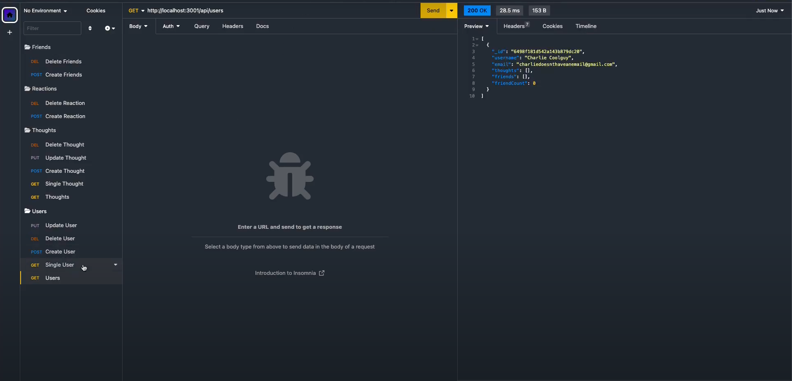

# Social Media Backend API Server

  
  
  
  ## Description
  
  The Social Media Backend API Server provides a NoSQL database connection and routes to Get Create Remove and Edit users and their posts and friends.

    

  ## Table of Contents
  
  - [Installation](#installation)
  - [Usage](#usage)
  - [Credits](#credits)
  - [License](#license)

   
  
  ## Installation / Dependencies

      Express and Mongoose (MongoDB)

  
   

  ## Usage

  Start the server and connect to the API endpoints at either /users or /thoughts and get, add, edit, and delete users in the database, create posts for users and allow them to reacte to other users thoughts. Users can also be added or removed as friends! [Link to Walkthrough](https://drive.google.com/file/d/105327qRsnB1kRY_UOOg_c-izoOMESmUE/view)

   
  
  ## Credits

      Github: andyr-dev Email: andy3942@gmail.com
  
  ## License

  This project is licensed under the [MIT License](https://opensource.org/licenses/MIT) license.
  
   

  ## Badges

    

   
  
  ## Questions

  If you have any questions, please feel free to email me at andy3942@gmail.com

  [Link to my GitHub](https://github.com/andyr-dev/)
  
   